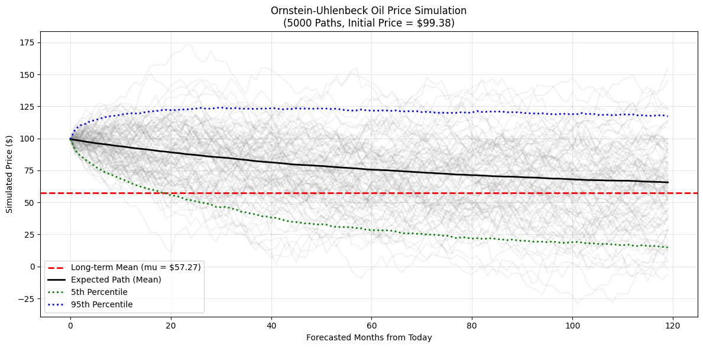

# Stochastic-Modeling-Oil-Prices
Stochastic modeling and mean reversion analysis of crude oil prices using the Ornstein-Uhlenbeck process in Python.

# Stochastic Modeling and Mean Reversion Analysis of Crude Oil Prices

## Overview
This project models the trajectory of crude oil prices using the **Ornstein-Uhlenbeck (OU) stochastic process**. 

The goal was to quantitatively assess recent price volatility and forecast the timeline for normalization. By calibrating historical data through Ordinary Least Squares (OLS) regression, we recovered the continuous-time parameters: long-term mean equilibrium ($\mu$), mean reversion speed ($\theta$), and volatility ($\sigma$). We then used the **Euler-Maruyama method** to perform Monte Carlo simulations to generate probabilistic price forecasts.

## Key Technical Skills
* **Stochastic Calculus:** Calibrating SDEs (Ornstein-Uhlenbeck).
* **Numerical Methods:** Euler-Maruyama discretization, Ordinary Least Squares (OLS) calibration.
* **Python Stack:** NumPy, Pandas, scikit-learn, Matplotlib.

## Visual Summary

### Historical Data

### Mean Price Calibration

### OU Simulation

## Project Structure
- `notebooks/`: Contains the Jupyter Notebook (`analysis.ipynb`) with the full mathematical derivation and simulations.
- `src/`: Contains the clean Python script (`calibration.py`) for production-level parameter extraction.
- `data/`: Placeholder for the historical dataset.

## License
Distributed under the MIT License. See `LICENSE` for more information.
